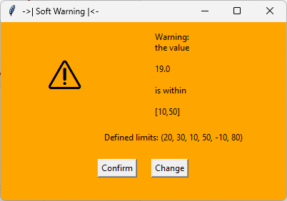
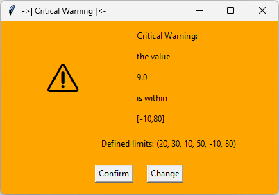
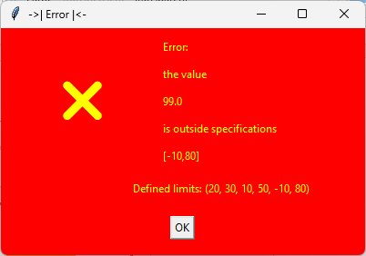

[](https://www.gnu.org/licenses/gpl-3.0) [](https://mybinder.org/v2/gh/sgiani95/tolmate/HEAD)

# TolMate

**TolMate** is a Python utility for checking if a value falls within specified tolerance ranges. It provides feedback via console messages and popup windows to alert users about the status of the value, whether it's within range or outside specifications.

---

## Features

- **Tolerance Checks**: Supports up to three (optional) levels of tolerance ranges:
  - **Tol 1**: Normal range
  - **Tol 2**: Soft warning
  - **Tol 3**: Hard warning


- **Interactive Popups**: Display user-friendly messages with color-coded warnings and action buttons.
- **Dynamic Value Rechecking**: Modify values directly from the popup for re-evaluation.
- **Behavior Configuration**: Enable or disable popups and console messages globally.
- **Simple API**: Easy to integrate into your existing Python projects.







- **Customizable Look**: Highlight alerts with built-in symbols or emojis.
- **Reusable and Lightweight**: Designed to integrate seamlessly into larger projects.

---

## Installation

You can install **TolMate** using pip.

```bash
pip install tolmate
```

## Requirements

- Python 3.x
- `tkinter` (comes pre-installed with Python)

---

## Usage

### Basic Example

```python
from tolmate import configure_behavior, tolmate

# Set global behavior for popups and messages (by default all True)
configure_behavior(show_popup=True, show_message=False)

# Main program example
def celsius_to_kelvin(celsius):
    """Convert Celsius to Kelvin."""
    return celsius + 273.15

# Main loop for initial value input
try:
    # Configure global behavior (example: enable both message and popup)
    value = float(input("\nEnter the temperature in degrees Celsius: "))

    if tolmate(value, 20, 40, 10, 50, 0, 60):  # Example ranges
        kelvin = celsius_to_kelvin(value)
        print(f"\nThe temperature in Kelvin is: {kelvin:.2f}")
    else:
        print("\nThe value is outside specifications.")

except ValueError:
    print("Please enter a valid number!")
```
